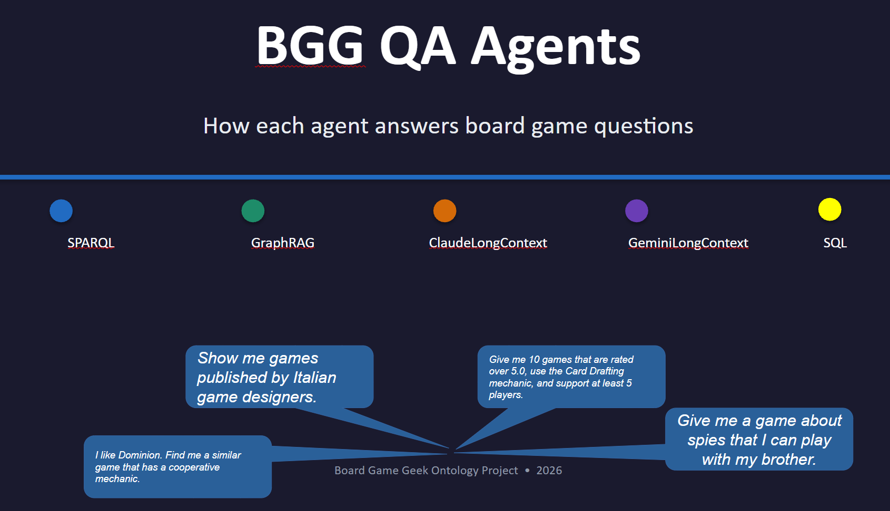
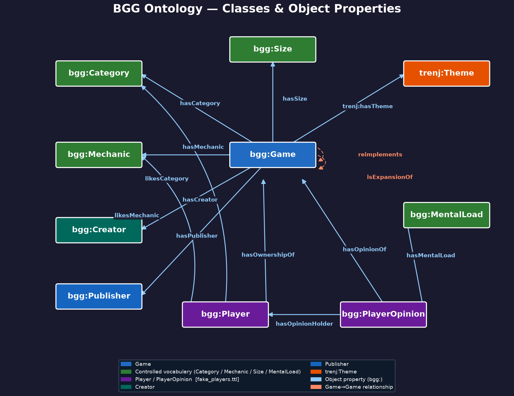
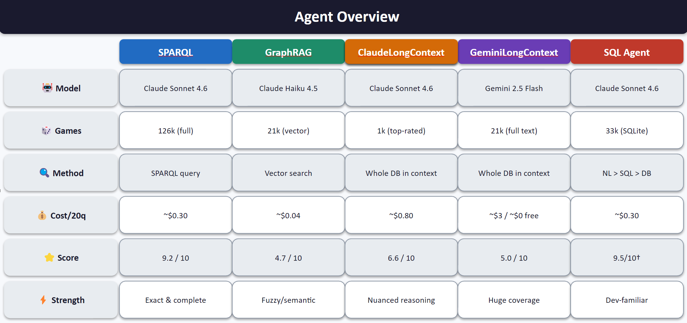

# Boardgame Ontology Project
*[Susanne Vejdemo](https://www.linkedin.com/in/susanne-vejdemo/) · 2026*

I love boardgames, ontologies, learning, and teaching. This project combines all of these things.
* I built an OWL/RDF **ontology** about boardgames to help answer such important questions as "what is the  board games about pirates can I play with my team of 6 people"\
* I built a **knowledge graph** from BoardGameGeek.com data. Intended as a practice dataset for people learning ontologies, knowledge graphs, and SPARQL — and as a testbed for comparing different LLM-based QA agents.
* I built **five  different Natural Language LLM Agents**, each with a different methodology to query the data. I find that most walkthroughs about these things are too complex, or half the code is omitted. I learnt a lot building the agents, and I hope it can be useful for other learners.
* I created a **SPARQL query practice sandbox**, because there are too few resources out there for people who want hands-on experience in learning SPARQL.

**[Interactive ontology graph](https://susvej.github.io/bg_ontology/)**



---

## Contents

- [The Ontology (T-BOX)](#the-ontology-t-box)
- [The Knowledge Graph (A-BOX)](#the-knowledge-graph-a-box)
- [Agents](#agents)
- [Agent Comparison](#agent-comparison)
- [SPARQL Practice](#sparql-practice)
- [Contact](#contact)

---

## The Ontology (T-BOX)

The ontology describes board games and the people who play them. It is intentionally kept simple — a good learning exercise is to extend it (for instance, adding more player interaction properties, or modelling game series).



For a fully interactive version where you can click classes and explore properties, see the **[interactive graph](https://susvej.github.io/bg_ontology/)**.

### Namespace

```
PREFIX bgg: <https://raw.githubusercontent.com/susvej/bg_ontology/>
```

### Classes

| Class | Description |
|---|---|
| `bgg:Game` | A board game, card game, or tabletop game listed on BGG |
| `bgg:Creator` | A person who designed a board game |
| `bgg:Category` | A thematic classification of a game (e.g. *Fantasy*, *War Game*) — controlled vocabulary |
| `bgg:Mechanic` | A gameplay mechanic (e.g. *Worker Placement*, *Deck Building*) — controlled vocabulary |
| `bgg:Publisher` | A company or individual that published a game |
| `bgg:Size` | Physical box size: `bgg:small` / `bgg:medium` / `bgg:large` |
| `bgg:MentalLoad` | Cognitive difficulty: `bgg:easy` / `bgg:moderate` / `bgg:difficult` |
| `bgg:Player` | A person who plays or owns board games — synthetic data only |
| `bgg:PlayerOpinion` | One player's rating and assessment of a specific game — synthetic data only |
| `trenj:Theme` | A thematic grouping from the Threnjen BGG database (e.g. *Steampunk*, *Pirates*) |

<details>
<summary><strong>Properties with <code>bgg:Game</code> as rdfs:domain</strong></summary>

**Datatype properties**

| Property | Type | Description |
|---|---|---|
| `bgg:hasName` | xsd:string | Game title |
| `bgg:hasID` | xsd:int | BGG numeric ID |
| `bgg:hasDescription` | xsd:string | Prose summary |
| `bgg:hasYearPublished` | xsd:int | Year of first publication |
| `bgg:hasRating` | xsd:double | Average community rating (1–10) |
| `bgg:hasGeekRating` | xsd:double | BGG Geek Rating (Bayesian average) |
| `bgg:hasMinPlayers` / `bgg:hasMaxPlayers` | xsd:int | Player count range |
| `bgg:hasBestNumPlayers` | xsd:int | Optimal player count |
| `bgg:hasMinGameTime` / `bgg:hasMaxGameTime` | xsd:int | Playtime in minutes |
| `bgg:hasMinRecAge` | xsd:int | Minimum recommended age |
| `bgg:isFullyEnriched` | xsd:boolean | Whether the game has complete structured data |

**Object properties**

| Property | Range | Description |
|---|---|---|
| `bgg:hasCategory` | `bgg:Category` | Thematic classification (89 values) |
| `bgg:hasMechanic` | `bgg:Mechanic` | Gameplay mechanic (176 values) |
| `bgg:hasCreator` | `bgg:Creator` | Designer |
| `bgg:hasPublisher` | `bgg:Publisher` | Publisher |
| `bgg:hasSize` | `bgg:Size` | Box size |
| `trenj:hasTheme` | `trenj:Theme` | Thematic grouping |
| `bgg:isExpansionOf` | `bgg:Game` | This game is an expansion of another |
| `bgg:reimplements` | `bgg:Game` | This game reimplements an earlier game |
| `bgg:hasURL` | URI | BGG page URL |
| `bgg:hasThumbnail` | URI | Cover image URL |

</details>

<details>
<summary><strong>Properties with <code>bgg:Player</code> / <code>bgg:PlayerOpinion</code> as domain or range</strong></summary>

**Datatype properties**

| Property  | Description |
|---|---|
| `bgg:hasPlayerRatingOpinion` | A bgg:Player has a personal rating on 1–10 scale |

| Object Property | Description |
|---|---|
| `bgg:hasOwnershipOf` | A bgg:player owns a bgg:Game |
| `bgg:isOwnedBy` | A bgg:Game is owned by a bgg:Player |
| `bgg:hasOpinionHolder` | A  bgg:PlayerOpinion is held by a bgg:Player|
| `bgg:hasOpinionOf` | A bgg:Player has a bgg:PlayerOpinion  |
| `bgg:hasMentalLoad` | Difficulty the player assigned |
| `bgg:likesCategory` / `bgg:likesMechanic` | Preferred categories and mechanics |

</details>


### Optional extension: `data/fake_players.ttl`

BoardGameGeek does not publish individual player data, so the classes `bgg:Player` and `bgg:PlayerOpinion` would have no instances if you only load `bgg_main.ttl`. The file `data/fake_players.ttl` fills that gap with **200 fictional players** with invented game collections and personal ratings — enough to practice ownership, rating, and social-graph queries.

It is kept as a **separate file** rather than merged into `bgg_main.ttl`, so the real BGG data stays clean and unmodified. Loading it is opt-in: load `bgg_main.ttl` alone for pure game queries, or load both together when you need player data.

```
PREFIX fake: <https://vejdemo.se/boardgames/fake#>
```

### Vocabulary

Category and mechanic instances are identified by IRI (e.g. `bgg:PartyGame`) and carry an `rdfs:label` (e.g. `"Party Game"`) and `skos:altLabel` values for common synonyms and abbreviations. There are **89 categories** and **176 mechanics**.

---

## The Knowledge Graph (A-BOX)

### `data/bgg_main.ttl` — real BGG data

The main dataset contains **33,754 games** sourced from BoardGameGeek via the BGG XML API and two Kaggle datasets (2018 and 2025 snapshots).

Not all games have complete data. Games marked `bgg:isFullyEnriched true` (~21,379) have structured categories, mechanics, themes, creators, and publishers. The remaining games have at minimum a name, BGG ID, and ratings.

The file also contains:
- **11,726 expansion links** (`bgg:isExpansionOf`)
- **Designer data** for enriched games (`bgg:hasCreator`)
- **Reimplementation links** (`bgg:reimplements`)

### `data/fake_players.ttl` — synthetic player data

Contains **200 synthetic players** (`bgg:Player`) with taste-clustered game ownership and personal ratings (`bgg:PlayerOpinion`). Players are divided into five taste clusters (Strategy, Cooperative, Party, Family, Thematic) with realistic overlap patterns, making social-graph queries interesting.

This data is kept in a separate file to avoid polluting the real BGG data. Load it alongside `bgg_main.ttl` when you need player-related queries.

```
PREFIX fake: <https://vejdemo.se/boardgames/fake#>
PREFIX svj:  <https://vejdemo.se/boardgames#>
```

---

## Agents

Five different QA agents answer natural-language questions about the knowledge graph. Each uses a different strategy and has different strengths.

### SPARQL Agent — `notebooks/bgg_sparql_qa.ipynb`

**How it works:** Claude translates the question into a SPARQL query, executes it against a GraphDB endpoint, then synthesises the results into a natural-language answer.

**Data coverage:** All 33,754 games in `bgg_main.ttl`.

**Strengths:** Precise counting, filtering, and aggregation. Can traverse relationships (e.g. "find all games designed by someone who also designed X"). Transparent — you can see the SPARQL it generated.

**Weaknesses:** Requires a running GraphDB instance. Quality of the SPARQL depends on the model's understanding of the ontology schema.

**Requirements:** Anthropic API key, GraphDB running locally with `bgg_main.ttl` loaded.

---

### Ollama SPARQL Agent — `notebooks/bgg_ollama_qa.ipynb`

**How it works:** Same SPARQL approach as the SPARQL Agent, but uses a local Ollama model instead of Claude.

**Data coverage:** All 33,754 games in `bgg_main.ttl`.

**Strengths:** Completely free to run, no API key needed. Useful for testing locally or for deployments where data privacy matters.

**Weaknesses:** Smaller local models write less reliable SPARQL, especially for complex multi-hop queries. Requires a running GraphDB instance and a running Ollama instance.

**Requirements:** GraphDB, Ollama with a compatible model (tested with `qwen2.5-coder:7b`).

---

### Gemini Long-Context Agent — `notebooks/bgg_gemini_qa.ipynb`

**How it works:** The knowledge graph is converted to a compact text representation (`data/games_db.txt`, `data/players_db.txt`) and the entire text is loaded into Gemini's very large context window. No SPARQL or vector search needed — the model reads the whole thing.

**Data coverage:** ~21,000 fully enriched games (those with structured categories, mechanics, and descriptions).

**Strengths:** Handles vague, exploratory, or qualitative questions well (e.g. "suggest some games in the style of Wingspan"). Does not need a structured endpoint.

**Weaknesses:** Counts and aggregations are unreliable when the model has to scan thousands of lines. Costs money (Gemini API). The full text is ~20,500 games and takes substantial context space.

**Requirements:** Google Gemini API key. Run the *build database* step once to generate `data/games_db.txt`.

---

### Claude Long-Context Agent — `notebooks/bgg_longcontext_qa.ipynb`

**How it works:** Builds the same text representation as the Gemini agent (`data/games_db.txt`, `data/players_db.txt`) and loads it into Claude's context window. Used as a baseline and as the data-building step for the Gemini agent.

**Data coverage:** The top ~1,000 games by rating (context window limit for Claude Sonnet at this context size).

**Strengths:** Good at nuanced, qualitative questions. Transparent reasoning. The database-building step runs once and the files are reused by both long-context agents.

**Weaknesses:** Coverage is limited to the top 1,000 games — questions about less popular games will come up empty.

**Requirements:** Anthropic API key. Set `BUILD_DATABASE = True` on first run.

---

### GraphRAG Agent — `notebooks/bgg_graphrag_qa.ipynb`

**How it works:** Converts the knowledge graph to text embeddings and stores them in a ChromaDB vector database (`data/chroma_bgg/`). For each question, it retrieves the most semantically relevant game descriptions, then passes only those to Claude to formulate an answer.

**Data coverage:** All ~21,000 enriched games indexed as embeddings.

**Strengths:** Scales to the full dataset without hitting context limits. Good at "similar to" and semantic matching queries. Persistent index — rebuilt once, reused forever.

**Weaknesses:** Retrieval quality depends on how well the question matches the embedding space. Can miss games that are relevant for structural (graph) reasons rather than semantic ones.

**Requirements:** Anthropic API key. Set `REBUILD_INDEX = True` on first run to build the ChromaDB index.

---

## Agent Comparison

All agents (except Ollama, which was not scored) are evaluated on the same **20 golden questions** covering a range of question types: factual lookups, counting/aggregation, multi-hop graph traversal, player social-graph queries, and open-ended recommendations.

### Results

**[Download the slide deck (bgg_agents_slides.pptx)](docs/bgg_agents_slides.pptx)** — covers how each agent works, a color-coded score grid (20 questions × 4 agents), and per-agent narrative summaries.



Each question was scored 0–10; a score of 9–10 means the answer was correct and complete, below 5 means it was wrong or misleading.

| Agent | Avg score (0–10) |
|---|---|
| SPARQL | 9.2 |
| Claude Long-Context | 6.6 |
| Gemini Long-Context | 5.0 |
| GraphRAG | 4.7 |

Key finding: the SPARQL agent dominates on counting, filtering, and graph traversal. The long-context agents do better on vague or qualitative questions where there is no single correct answer.

### Files

| File | Description |
|---|---|
| [`qa/GoldenQandA_June17.md`](qa/GoldenQandA_June17.md) | Questions and reference answers (human-readable) |
| [`qa/GoldenQandA_June17.xml`](qa/GoldenQandA_June17.xml) | Machine-readable version used by the autoscorer |
| [`qa/qa_log.jsonl`](qa/qa_log.jsonl) | Raw log of all agent answers |
| [`qa/bgg_sparql_compare.py`](qa/bgg_sparql_compare.py) | Runs the SPARQL agent against all 20 questions |
| [`qa/bgg_sql_compare.py`](qa/bgg_sql_compare.py) | Runs the SQL agent (comparison baseline) |
| [`qa/_autoscore.py`](qa/_autoscore.py) | Auto-scores answer log entries using Claude Haiku |

The comparison also explores where SPARQL has a structural advantage over SQL — particularly for property-path queries (arbitrary-depth traversal with `+` / `*`) and graph connectivity queries that would require `WITH RECURSIVE` in SQL.

---

## SPARQL Practice

Two notebooks with 30+ exercises covering SPARQL from basics to advanced features. They use `bgg_main.ttl` and `fake_players.ttl` as the practice dataset, so the queries are about real board games.

Topics covered include: basic SELECT, FILTER, OPTIONAL, aggregation (COUNT, AVG, GROUP BY, HAVING), property paths (`+`, `*`, `^`), UNION, BIND, FILTER NOT EXISTS, and the Open World Assumption.

| Notebook | Description |
|---|---|
| [`notebooks/Practice_SPARQL_local.ipynb`](notebooks/Practice_SPARQL_local.ipynb) | Runs in VS Code or Jupyter — loads files locally with rdflib, no server needed |

---

## Contact


